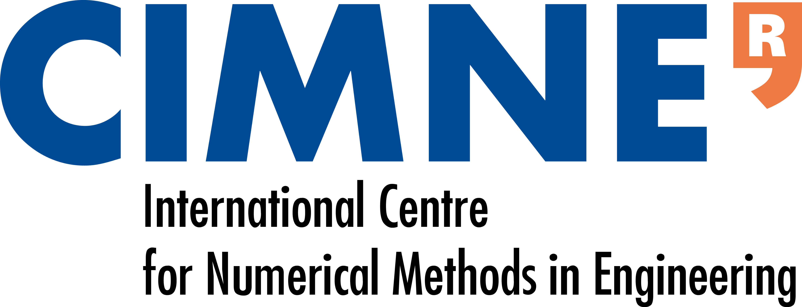
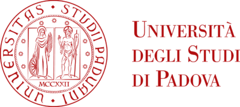

```{=html}
<section class="collaborations-intro">
  <p class="research-kicker">Research network</p>
  <p class="collaborations-lead">Current research collaborations across computational mechanics, numerical methods, and applied mathematics.</p>
</section>

<section class="collaborations-grid" aria-label="Current research collaborations">

<article class="collaboration-card">
  <div class="collaboration-logos collaboration-logos-pair">
    <a href="https://www.upc.edu/en" target="_blank" rel="noopener" aria-label="Visit the Universitat Politècnica de Catalunya website"></a>
    <a href="https://cimne.com/" target="_blank" rel="noopener" aria-label="Visit the CIMNE website"></a>
  </div>
  <div class="collaboration-content">
    <p class="collaboration-place">UPC–CIMNE · Barcelona, Spain</p>
    <h2><a href="https://futur.upc.edu/UxueChascoGoni" target="_blank" rel="noopener">Uxue Chasco</a> · <a href="https://futur.upc.edu/InocencioCastanarPerez" target="_blank" rel="noopener">Inocencio Castañar</a></h2>
    <p>Collaboration on finite element and fluid–structure interaction methods, as well as Material Point Methods for free-surface flows and natural hazards.</p>
    <p class="collaboration-secondary">Also collaborating with <a href="https://deca.upc.edu/en/people/ramon.codina" target="_blank" rel="noopener">Ramon Codina</a> and <a href="https://futur.upc.edu/JoanBaigesAznar" target="_blank" rel="noopener">Joan Baiges</a>.</p>
  </div>
</article>

<article class="collaboration-card">
  <div class="collaboration-logos">
    <a href="https://www.unipd.it/en/" target="_blank" rel="noopener" aria-label="Visit the University of Padua website"></a>
  </div>
  <div class="collaboration-content">
    <p class="collaboration-place">University of Padua · Italy</p>
    <h2><a href="https://antonialarese.github.io/" target="_blank" rel="noopener">Antonia Larese</a></h2>
    <p>Development of new Material Point Method formulations, with particular emphasis on mixed formulations for incompressible materials.</p>
  </div>
</article>

<article class="collaboration-card">
  <div class="collaboration-logos">
    <a href="https://www.cee.ed.tum.de/en/st/home/" target="_blank" rel="noopener" aria-label="Visit the TUM Chair of Structural Analysis website"></a>
  </div>
  <div class="collaboration-content">
    <p class="collaboration-place">Technical University of Munich · Germany</p>
    <h2><a href="https://www.cee.ed.tum.de/en/st/members/roland-wuechner/" target="_blank" rel="noopener">Roland Wüchner</a></h2>
    <p>Collaboration on Material Point Methods, connecting numerical developments with experimental research.</p>
  </div>
</article>

<article class="collaboration-card">
  <div class="collaboration-logos collaboration-logo-seal">
    <a href="https://dimec.usach.cl/" target="_blank" rel="noopener" aria-label="Visit the USACH Department of Mechanical Engineering website"></a>
  </div>
  <div class="collaboration-content">
    <p class="collaboration-place">Universidad de Santiago de Chile · Chile</p>
    <h2><a href="https://dimec.usach.cl/somos-dimec/academicos/#" target="_blank" rel="noopener">Óscar Ruz</a></h2>
    <p>Development of a research line in computational hemodynamics, focusing on thrombus-related problems through FEM and fluid–structure interaction.</p>
  </div>
</article>

</section>
```
