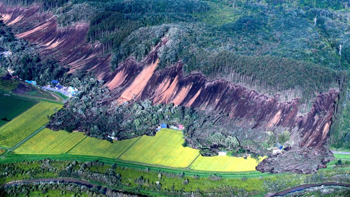
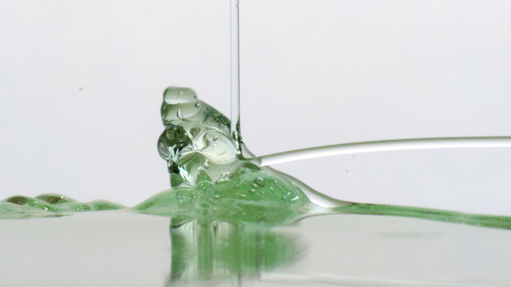

```{=html}
<div class="research-intro">
  <p class="research-kicker">Computational mechanics · Applied mathematics · Scientific computing</p>
  <p class="research-lead">I develop mathematical models and numerical methods for complex fluid, solid, and coupled problems.</p>
</div>

<div class="research-grid">

<article class="research-card">
  <div class="research-card-media">
    
    <span class="research-status current">Current research</span>
  </div>
  <div class="research-card-body">
    <p class="research-number">01</p>
    <h2>Material Point Method &amp; Extreme Events</h2>
    <p>Numerical methods for solids and fluids undergoing large deformations, with particular emphasis on hydrological hazards and incompressible materials.</p>
    <div class="research-tags"><span>MPM</span><span>Large deformations</span><span>Mixed formulations</span><span>Kratos</span></div>
    <a class="research-link" href="research_mpm.qmd">Explore this research <span aria-hidden="true">→</span></a>
  </div>
</article>

<article class="research-card">
  <div class="research-card-media">
    
    <span class="research-status expertise">Core expertise</span>
  </div>
  <div class="research-card-body">
    <p class="research-number">02</p>
    <h2>Viscoelastic &amp; Complex Fluid Flows</h2>
    <p>Stable and accurate finite element techniques for highly elastic flows, including thermal effects and challenging constitutive behavior.</p>
    <div class="research-tags"><span>FEM</span><span>Stabilization</span><span>Log-conformation</span><span>Thermal coupling</span></div>
    <a class="research-link" href="research_viscoelastic-flows.qmd">Explore this research <span aria-hidden="true">→</span></a>
  </div>
</article>

<article class="research-card">
  <div class="research-card-media research-placeholder">
    <div><strong>Image placeholder</strong><small>Hemodynamics geometry, flow field, or FSI result</small></div>
    <span class="research-status current">Current research</span>
  </div>
  <div class="research-card-body">
    <p class="research-number">03</p>
    <h2>Fluid–Structure Interaction &amp; Hemodynamics</h2>
    <p>Coupled simulation of fluids and deformable structures, connecting numerical formulation development with cardiovascular flow problems.</p>
    <div class="research-tags"><span>FSI</span><span>Hemodynamics</span><span>Coupled problems</span><span>FEM</span></div>
    <span class="research-link research-link-muted">Detailed research page in preparation</span>
  </div>
</article>

<article class="research-card">
  <div class="research-card-media research-placeholder research-placeholder-dark">
    <div><strong>Image placeholder</strong><small>Telescope airflow or train-in-tunnel simulation</small></div>
    <span class="research-status applications">Selected applications</span>
  </div>
  <div class="research-card-body">
    <p class="research-number">04</p>
    <h2>Computational Aerodynamics &amp; Engineering Applications</h2>
    <p>Simulation of complex flows in realistic geometries, from atmospheric effects around telescopes to transient aerodynamic loads in railway tunnels.</p>
    <div class="research-tags"><span>CFD</span><span>Moving domains</span><span>Turbulence</span><span>Real geometries</span></div>
    <a class="research-link" href="research_fem-complex-flows.qmd">See selected applications <span aria-hidden="true">→</span></a>
  </div>
</article>

</div>
```

## Methods & tools {.research-section-title}

```{=html}
<div class="methods-strip">
  <span>Finite Element Method</span><span>Material Point Method</span><span>Stabilized formulations</span><span>Mixed formulations</span><span>Multiphysics coupling</span><span>Kratos Multiphysics</span><span>Scientific computing</span>
</div>
```

```{=html}
<p class="research-note">Research lines naturally overlap: the same numerical methods can connect fundamental developments, multiphysics problems, and applications across engineering and biomedicine.</p>
```
