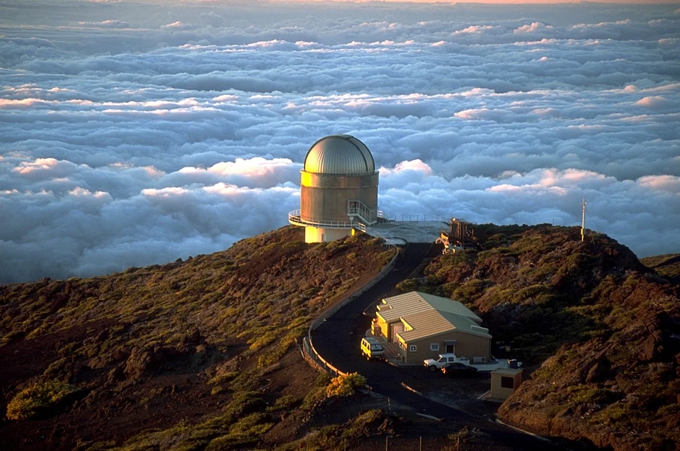
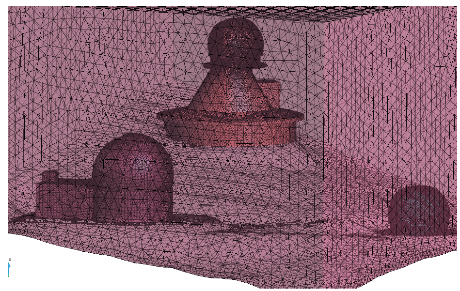
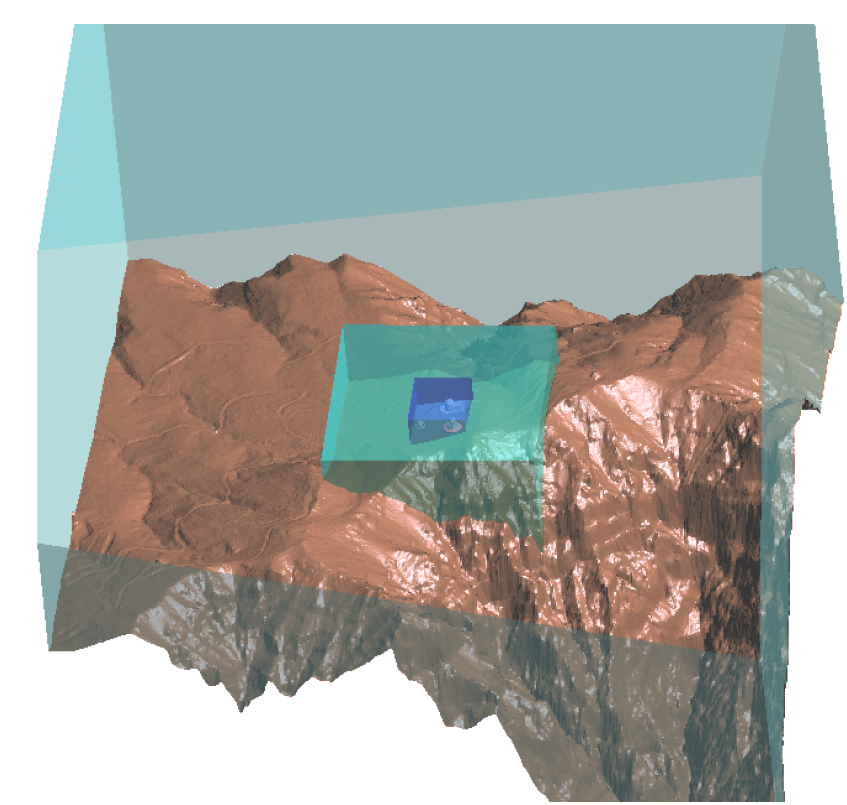
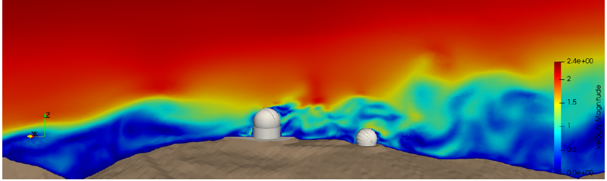
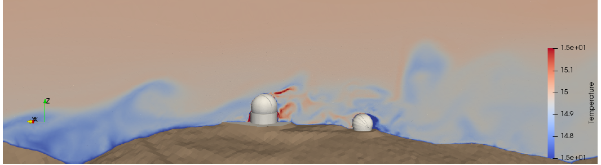
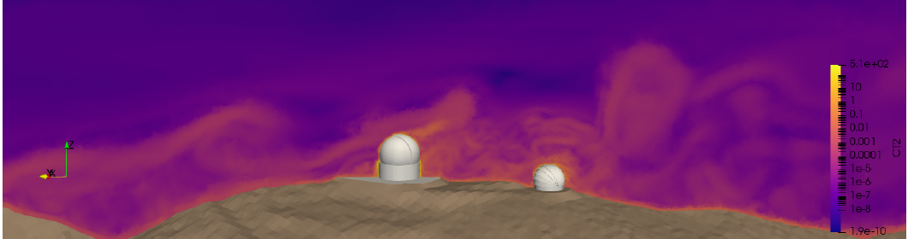
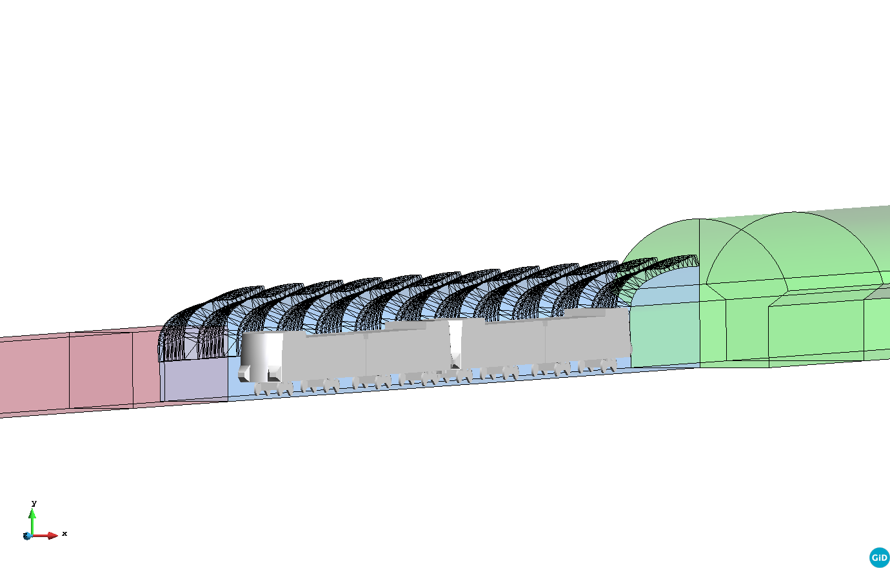
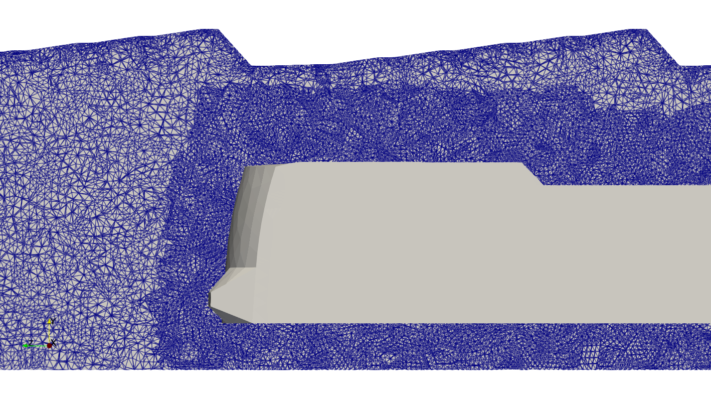
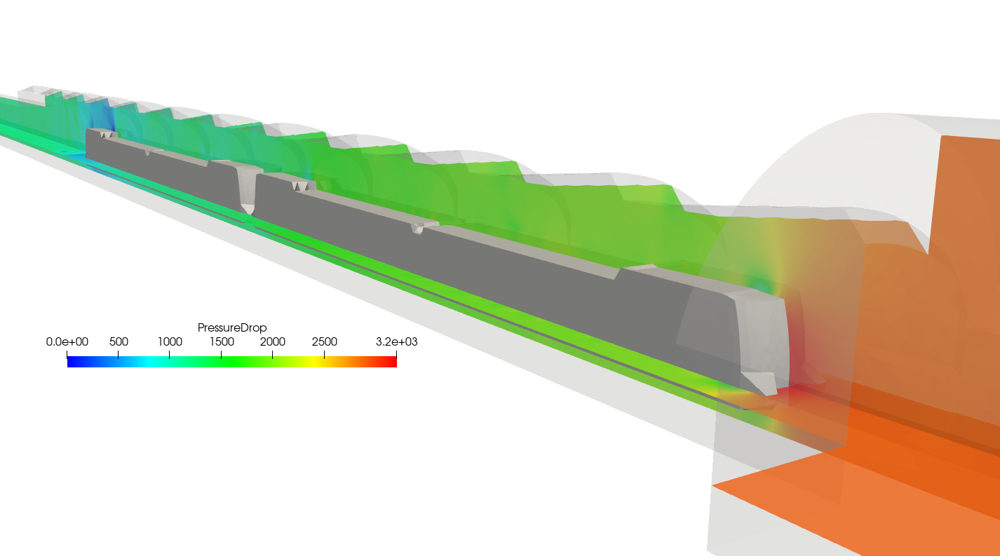
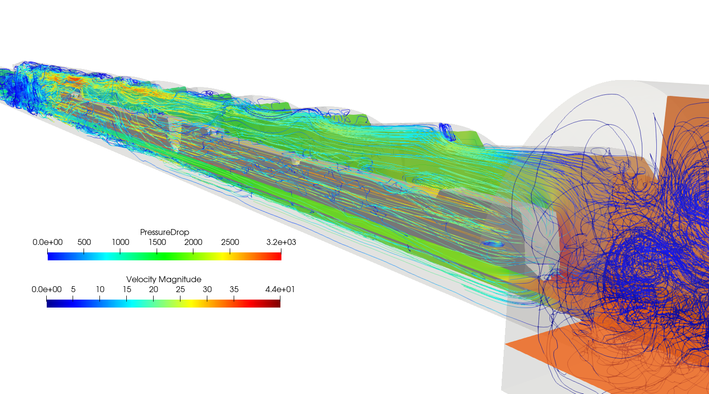

```{=html}
<main class="apps-page">
  <a class="apps-back" href="research.qmd">← Research areas</a>

  <nav class="apps-nav" aria-label="On this page">
    <span>On this page</span><a href="#apps-telescopes">01 Telescopes</a><a href="#apps-train">02 Train aerodynamics</a><a href="#apps-related">03 Related work</a>
  </nav>

  <section class="apps-hero">
    <div class="apps-hero-copy">
      <p class="apps-kicker">Selected engineering applications</p>
      <p class="apps-lead">During my doctoral research, I also applied computational fluid dynamics to two large-scale engineering problems: atmospheric-flow effects around astronomical telescopes and the transient aerodynamics generated by a train moving through a tunnel.</p>
      <div class="apps-tags"><span>Computational fluid dynamics</span><span>Finite elements</span><span>Turbulence</span><span>HPC</span><span>Real geometries</span></div>
    </div>
    <figure class="apps-hero-media">
      
      <figcaption>Nordic Optical Telescope at the Roque de los Muchachos Observatory. Photo: Bob Tubbs / Wikimedia Commons · Public domain.</figcaption>
    </figure>
  </section>

  <section class="apps-section" id="apps-telescopes">
    <div class="apps-section-heading"><p class="apps-section-number">01</p><div><p class="apps-eyebrow">Engineering application I</p><h2>Atmospheric flow and telescope optical quality</h2></div></div>

    <div class="apps-work-intro">
      <div>
        <p>The European Solar Telescope project required assessing whether the future EST could degrade the optical quality of the nearby William Herschel Telescope at the Roque de los Muchachos Observatory. The problem connects external aerodynamics with thermal transport: wakes and temperature fluctuations produced around one telescope can alter the refractive properties of the air through which another telescope observes.</p>
        <p>Starting from CAD models supplied by the Instituto de Astrofísica de Canarias, we constructed a three-dimensional computational domain incorporating the telescopes and the real surrounding terrain. We then solved the incompressible Navier–Stokes and temperature equations and used the resulting thermal field to evaluate optical-turbulence indicators.</p>
      </div>
      <aside class="apps-facts"><p class="apps-focus-label">Technical focus</p><span>Real terrain and CAD geometries</span><span>Incompressible Navier–Stokes</span><span>Thermal coupling</span><span>Smagorinsky turbulence model</span><span>Optical-quality indicators</span></aside>
    </div>

    <div class="apps-geometry-grid">
      <figure><figcaption><strong>From terrain to computational domain.</strong> Nested regions concentrate the numerical resolution around the observatory while retaining the influence of the surrounding topography.</figcaption></figure>
      <figure><figcaption><strong>Local finite element mesh.</strong> The telescope CAD models are embedded in a detailed discretisation of the nearby atmospheric domain.</figcaption></figure>
    </div>

    <div class="apps-result-heading"><p class="apps-focus-label">Selected simulation fields</p><h3>Following the wake from flow to optical disturbance</h3><p>The simulation resolves how the terrain and telescope geometries reshape the wind field and its wake. The coupled temperature solution then provides the information required to estimate fluctuations in the refractive index of air and assess their possible effect on astronomical observations.</p></div>
    <figure class="apps-wide-figure"><figcaption><strong>Velocity magnitude.</strong> Terrain and telescope wakes generate a strongly heterogeneous atmospheric flow across the observatory.</figcaption></figure>
    <div class="apps-comparison">
      <figure><figcaption><strong>Temperature field.</strong> Thermal fluctuations are transported through the telescope wakes.</figcaption></figure>
      <figure><figcaption><strong>Optical-turbulence indicator.</strong> The refractive-index structure parameter translates thermal-flow information into a quantity relevant to image quality.</figcaption></figure>
    </div>
    <p class="apps-result"><strong>What the study connects:</strong> a realistic CFD calculation becomes an optical-quality assessment by linking terrain-resolved wind, turbulent mixing, temperature transport, and atmospheric refractive-index fluctuations.</p>
  </section>

  <section class="apps-section" id="apps-train">
    <div class="apps-section-heading"><p class="apps-section-number">02</p><div><p class="apps-eyebrow">Engineering application II</p><h2>A train moving through the Mont-Royal Tunnel</h2></div></div>

    <div class="apps-work-intro">
      <div>
        <p>This project studied the transient aerodynamic loads generated as a train travels through tunnel sections of different shape and cross-sectional area. The practical objective was to evaluate pressure peaks for the structural design of fire-resistant panels installed on the tunnel separation wall.</p>
        <p>The train moves at 100 km/h through a 590 m computational model containing narrow, curved, and wide tunnel sections. Representing this motion with a body-fitted mesh would demand severe mesh deformation or continuous remeshing, so the problem was solved using an embedded fixed-mesh strategy.</p>
      </div>
      <aside class="apps-facts"><p class="apps-focus-label">Technical focus</p><span>Moving domains</span><span>Fixed-mesh ALE</span><span>Embedded finite elements</span><span>Adaptive mesh refinement</span><span>Parallel computing</span></aside>
    </div>

    <figure class="apps-wide-figure apps-train-geometry"><figcaption><strong>Moving-domain problem.</strong> The train crosses a curved transition between tunnel sections with substantially different areas.</figcaption></figure>

    <div class="apps-method-card">
      <div><p class="apps-focus-label">Embedded strategy</p><h3>Motion without deforming the flow mesh</h3><p>A foreground mesh represents the train and follows its rigid motion. The incompressible flow is solved on a fixed background mesh representing the tunnel. At every time step, the train position and velocity are transferred to the background discretisation and imposed weakly on the cut elements using Nitsche's method.</p></div>
      <figure><figcaption><strong>Adaptive refinement.</strong> Fine elements follow the train through the fixed tunnel mesh, concentrating resolution where the most complex flow structures occur.</figcaption></figure>
    </div>

    <div class="apps-scale-strip">
      <div><strong>60M+</strong><span>tetrahedral elements at peak refinement</span></div><div><strong>8M+</strong><span>nodes</span></div><div><strong>1,000</strong><span>time steps</span></div><div><strong>224</strong><span>CPU cores</span></div>
    </div>

    <div class="apps-result-heading"><p class="apps-focus-label">Selected results</p><h3>Pressure loads and a turbulent train wake</h3><p>The moving train pushes air ahead of its nose while drawing a wake behind it. Flow separation creates vortices along the train and at sharp tunnel edges; the highest pressure occurs near the nose, while the strongest suction develops around the tail.</p></div>
    <div class="apps-train-results">
      <figure><figcaption><strong>Pressure distribution.</strong> The embedded simulation captures the pressure rise at the train nose and suction towards its tail.</figcaption></figure>
      <figure><figcaption><strong>Flow streamlines.</strong> Recirculation and wake structures develop as displaced air passes through the changing tunnel section.</figcaption></figure>
    </div>
    <p class="apps-result"><strong>What it demonstrates:</strong> the fixed-mesh ALE formulation transfers the motion of a geometrically detailed train to a fixed flow mesh, enabling a fully transient, large-scale calculation that would be difficult to perform with a conventional ALE mesh.</p>
  </section>

  <section class="apps-section" id="apps-related">
    <div class="apps-section-heading"><p class="apps-section-number">03</p><div><p class="apps-eyebrow">Related work</p><h2>Publication, projects, and software</h2></div></div>

    <div class="apps-related-grid">
      <article class="apps-publication">
        <span class="apps-status published">Published · 2023</span>
        <h3>An embedded strategy for large scale incompressible flow simulations in moving domains</h3>
        <p>Ramon Codina, Joan Baiges, Inocencio Castañar, Ignacio Martínez-Suárez, Laura Moreno, and Samuel Parada · <em>Journal of Computational Physics</em>, 488, 112181.</p>
        <p><a href="https://doi.org/10.1016/j.jcp.2023.112181">DOI</a> · <a href="assets/docs/artweb007-lm.pdf">Post-print</a></p>
      </article>
      <article class="apps-software"><p class="apps-focus-label">Research software</p><h3>FEMUSS</h3><p>Both applications were simulated with FEMUSS, an in-house finite element research code written and developed in Fortran at CIMNE. The software is not currently available through a public repository.</p></article>
    </div>

    <div class="apps-projects-grid">
      <article><p class="apps-focus-label">Knowledge-transfer contract</p><h3>European Solar Telescope</h3><p>Optical Quality Assessment for the European Solar Telescope · Instituto de Astrofísica de Canarias and CIMNE · 2020.</p><a href="projects.qmd#european-solar-telescope">View project details →</a></article>
      <article><p class="apps-focus-label">Knowledge-transfer contract</p><h3>Mont-Royal Tunnel</h3><p>Aerodynamic Loads on the Separation Wall of the Mont-Royal Tunnel · EWE+ General Partnership and CIMNE · 2020.</p><a href="projects.qmd#mont-royal-tunnel">View project details →</a></article>
    </div>

    <div class="apps-team"><p><strong>A collaborative effort.</strong> Both projects were developed as a team by Ramon Codina, Joan Baiges, Inocencio Castañar, Ignacio Martínez-Suárez, Laura Moreno, and Samuel Parada. The numerical methodology, computational work, interpretation of the results, and resulting publication grew from this shared effort.</p></div>
    <div class="apps-contribution"><p><strong>My role within the team.</strong> For the telescope study, I generated computational meshes from the supplied CAD models, performed numerical simulations, analysed and compared the optical-quality results, and contributed to the technical reports. For the tunnel project, I designed and generated computational meshes, performed aerodynamic simulations, analysed and validated the results, and contributed to the technical reports and the resulting scientific publication.</p></div>
  </section>
</main>
```
