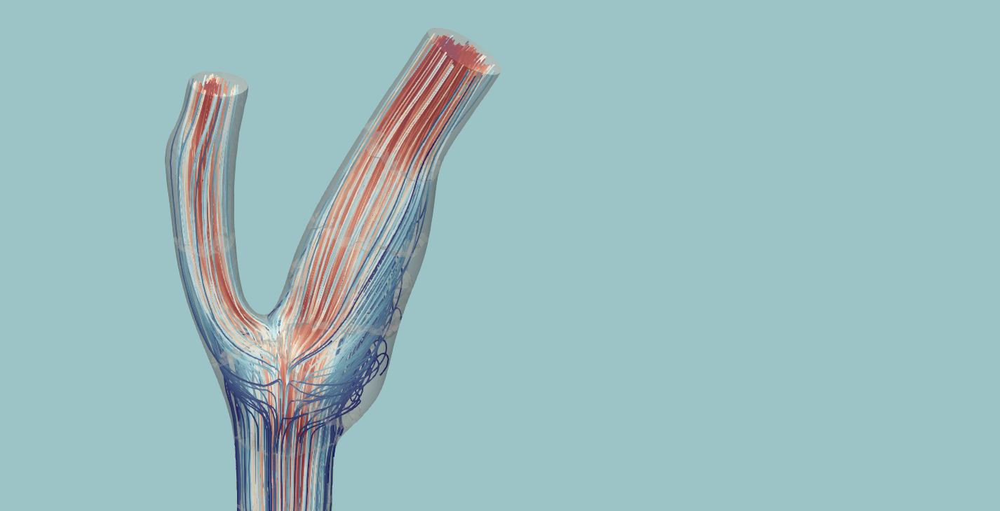
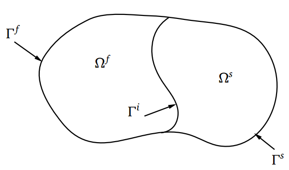
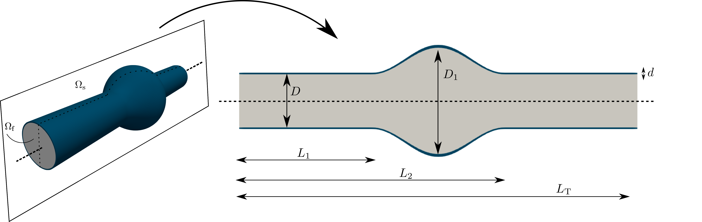
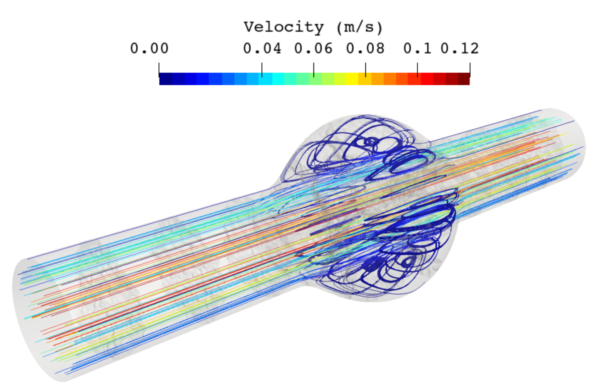
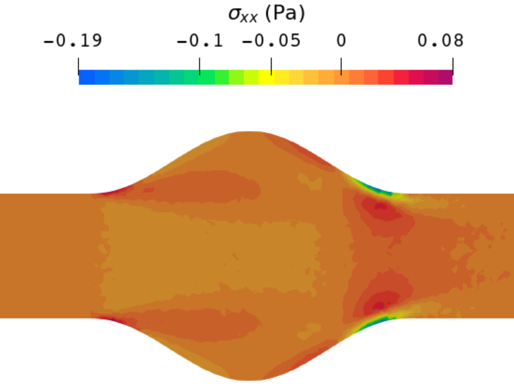
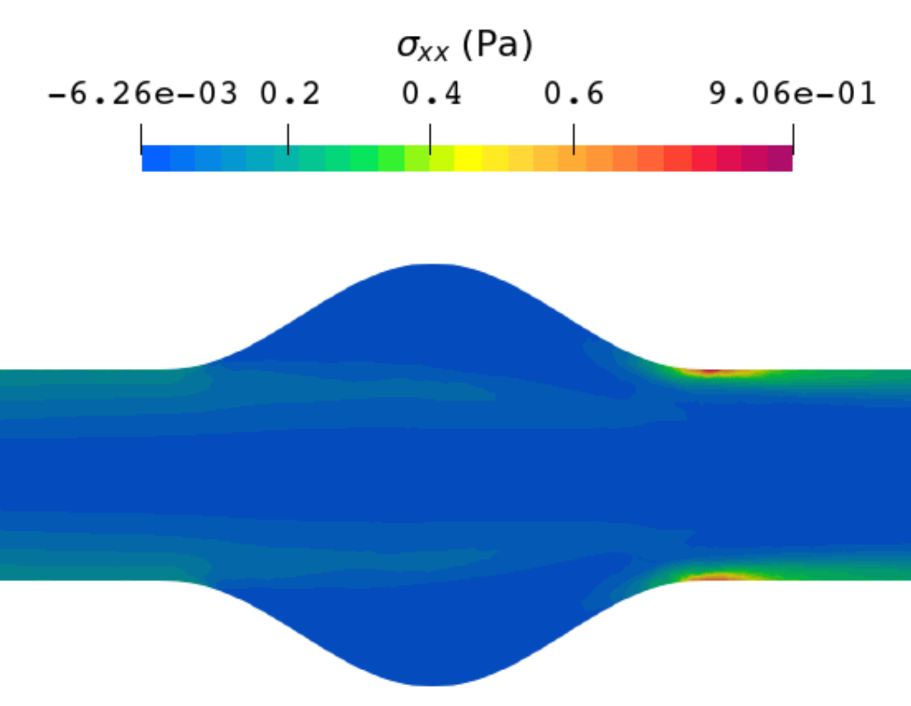
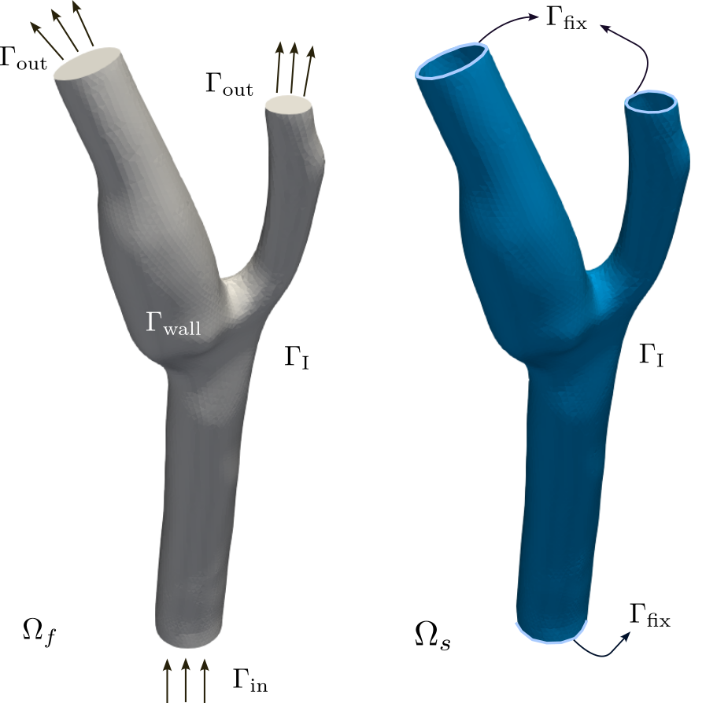
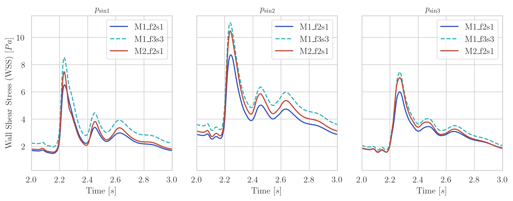
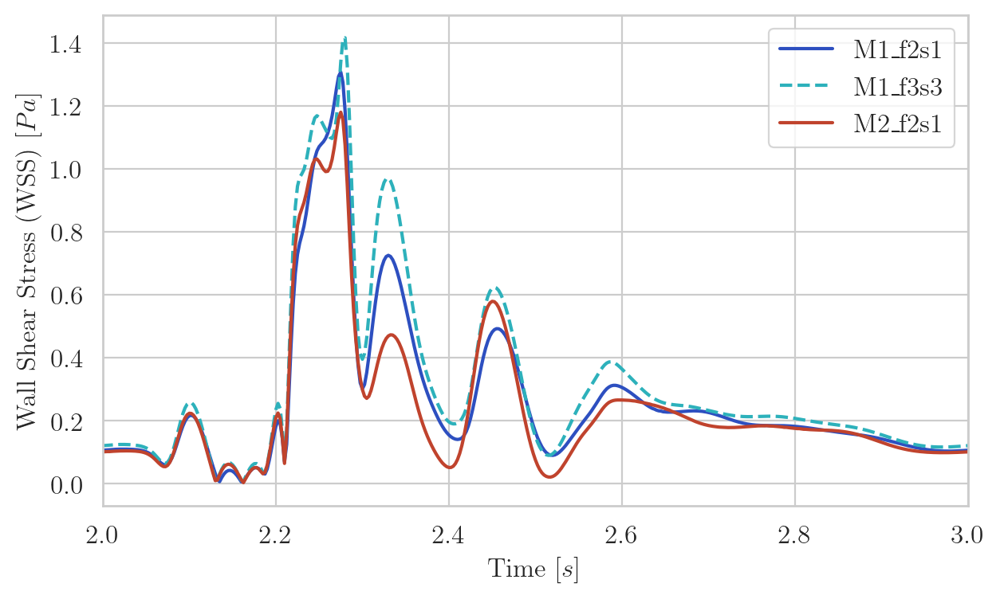

~~~{=html}
<main class="fsi-page">
  <a class="fsi-back" href="research.qmd">← Research areas</a>

  <nav class="fsi-nav" aria-label="On this page">
    On this page<a href="#fsi-overview">01 Overview</a><a href="#fsi-viscoelastic">02 Viscoelastic FSI</a><a href="#fsi-mixed">03 Mixed formulations</a><a href="#fsi-context">04 Related work</a>
  </nav>

  <section class="fsi-hero">
    

      
Coupled multiphysics research

      
We develop finite element formulations for fluid–structure interaction, with particular emphasis on complex fluid rheology, accurate stress transmission, and cardiovascular applications.

      
Fluid–structure interactionHemodynamicsMixed formulationsViscoelasticityFEM

    

    <figure class="fsi-hero-media">
      
      <figcaption>Blood flow through a deformable carotid bifurcation.</figcaption>
    </figure>
  </section>

  <section class="fsi-section" id="fsi-overview">
    

01

Overview
<h2>A two-way multiphysics problem</h2>

    

      

        
In fluid–structure interaction (FSI), a fluid exerts pressure and shear forces on a deformable solid. The resulting structural motion changes the fluid domain, which in turn modifies the flow and the loads applied at the interface. Neither problem can be solved accurately in isolation.

        
This feedback is especially important in hemodynamics. Blood motion depends on arterial deformation, while the vessel wall responds to the pulsatile pressure and shear generated by the flow. Reliable simulations must therefore couple fluid mechanics, solid mechanics, moving-domain kinematics, and interface conditions.

      

      <figure class="fsi-sketch">
        
        <figcaption><strong>FSI problem.</strong> The fluid and solid domains, their shared interface, and the external boundary conditions of each subdomain are represented. Across the interface, kinematic compatibility and traction equilibrium couple the two problems.</figcaption>
      </figure>
    

    

      

Strong partitioned coupling
<h3>Dirichlet–Neumann block iteration</h3>
At every time step, the fluid and solid solvers are advanced sequentially until the interface conditions converge.

      

        
1<strong>Solid solve</strong>
Apply the tractions computed by the fluid and obtain the structural displacement and interface velocity.

        
↓

        
2<strong>Aitken relaxation</strong>
Dynamically relax the interface velocity to accelerate and stabilize the strong coupling.

        
↓

        
3<strong>ALE mesh update</strong>
Propagate the relaxed interface motion through the fluid mesh and compute its domain velocity.

        
↓

        
4<strong>Fluid solve</strong>
Solve the ALE fluid equations using the updated mesh and the relaxed velocity at the interface.

      

      
<strong>Interface converged?</strong><b>No</b> → update fluid tractions and repeat the block iteration<b>Yes</b> → advance to the next time step

    

    

Why is it numerically demanding?

The coupling is nonlinear and bidirectional; fluid and solid variables live on different domains; incompressibility may introduce pressure and stress instabilities; and the moving fluid mesh must remain valid throughout the simulation. In hemodynamics, small errors in near-wall gradients can also affect clinically relevant quantities such as wall shear stress.

  </section>

  <section class="fsi-section fsi-work" id="fsi-viscoelastic">
    

02

Research work I
<h2>FSI with viscoelastic fluids</h2>

    

      

        
Many FSI models assume a Newtonian fluid, but fluids with microstructure can store and release elastic energy. Their additional stress evolution makes the coupled problem substantially harder, particularly when elastic effects dominate.

        
We developed and implemented a partitioned finite element framework coupling an Oldroyd-B viscoelastic fluid with a hyperelastic solid. A VMS-stabilized log-conformation formulation controls the exponential growth of elastic stresses and extends the range of regimes that can be solved robustly.

      

      <aside class="fsi-facts">
Technical focus
Oldroyd-B rheologyLog-conformationVMS stabilizationHyperelastic wallsPartitioned coupling</aside>
    

    

Selected result
<h3>Three-dimensional abdominal aortic aneurysm</h3>
Blood is modeled first as a Newtonian fluid and then as a viscoelastic fluid, while the arterial wall is represented as a deformable hyperelastic solid. A Newtonian approximation neglects stress relaxation and normal-stress effects associated with blood microstructure. The paper highlights that these effects become particularly relevant at higher flow rates and in low-shear recirculation regions, where earlier studies reported differences of approximately 40% relative to a Newtonian model. Accounting simultaneously for viscoelastic blood and deformable arterial walls therefore provides a more complete representation of flow recirculation and stress transmission in the aneurysm.

    <figure class="fsi-wide-figure fsi-aneurysm-geometry"><figcaption><strong>Coupled aneurysm model.</strong> A fluid domain surrounded by a deformable wall is constructed from an idealized arterial geometry.</figcaption></figure>
    <figure class="fsi-wide-figure"><figcaption><strong>Three-dimensional recirculation.</strong> Streamlines reveal vortical structures developing close to the aneurysm wall.</figcaption></figure>
    

      <figure><figcaption><strong>Newtonian model</strong> · First stress component</figcaption></figure>
      <figure><figcaption><strong>Viscoelastic model</strong> · First stress component</figcaption></figure>
    

    
<strong>What it demonstrates:</strong> fluid viscoelasticity shifts the vortex centers downstream and substantially changes the stress distribution near the aneurysm wall. These differences should not be underestimated when flow rates increase.

  </section>

  <section class="fsi-section fsi-work" id="fsi-mixed">
    

03

Research work II
<h2>Mixed formulations for accurate FSI stresses</h2>

    

      

        
This work studies how the choice of primary unknowns affects coupled FSI simulations. Alongside conventional irreducible formulations, mixed three-field formulations introduce stress as an independent nodal variable in both the fluid and the solid.

        
The VMS framework enables stable equal-order interpolation, improves pressure and stress fields, and reduces sensitivity to mesh refinement. This is particularly valuable when interface tractions or wall shear stress (not only global motion)are quantities of interest.

      

      <aside class="fsi-facts">
Technical focus
Two- vs. three-fieldStress as unknownVMS stabilizationALE fluid domainWall shear stress</aside>
    

    

Selected result
<h3>Pulsatile flow through a carotid bifurcation</h3>
A three-dimensional deformable carotid model is used to examine velocity, pressure, and wall shear stress over multiple cardiac cycles. The carotid sinus and bifurcation apex provide demanding regions with recirculation, low shear, and sharp stress gradients.

    

      <figure><figcaption><strong>Coupled domains.</strong> Blood and the deformable arterial wall share the FSI interface.</figcaption></figure>
      <figure class="fsi-video-figure"><video autoplay muted loop playsinline controls preload="metadata" aria-label="Arterial-wall displacement through a pulsatile cycle in a three-dimensional carotid bifurcation"><source src="assets/research-fsi-hemodynamics/carotide.mp4" type="video/mp4"></video><figcaption><strong>Pulsatile wall response.</strong> The colour field represents the displacement magnitude of the arterial wall, which evolves in response to the time-varying blood inflow.</figcaption></figure>
    

    

      
Configurations compared in the WSS plots

      
<strong>M1_f2s1</strong>Coarse mesh · irreducible fluid and solid formulations

      
<strong>M1_f3s3</strong>Same coarse mesh · mixed three-field fluid and solid formulations

      
<strong>M2_f2s1</strong>Refined mesh · irreducible fluid and solid formulations

      
The comparison separates the effect of changing the formulation from the effect of refining the mesh.

    

    

      

Carotid sinus
<h3>Resolving low-shear and reattachment regions</h3>
All formulations capture the low-WSS region associated with recirculation, but M1_f3s3 resolves the subsequent peaks and temporal variations more sharply. In the irreducible formulation, WSS must be recovered from velocity gradients; in the mixed formulation, deviatoric stress is already a nodal primary unknown and WSS follows directly from that stress field. This improves stress accuracy without requiring the refined M2 mesh.

      <figure><figcaption>Wall shear stress over one cardiac cycle at three sinus locations.</figcaption></figure>
    

    

      <figure><figcaption>Comparison of formulations at the high-shear bifurcation apex.</figcaption></figure>
      

Bifurcation apex
<h3>Capturing sharp WSS peaks</h3>
The three-field M1_f3s3 formulation captures a higher and sharper peak than M1_f2s1 on the same mesh, and can outperform the refined irreducible M2_f2s1 configuration. Resolving these gradients matters because chronically low WSS is associated with endothelial dysfunction and atherosclerotic plaque formation, whereas excessively high WSS and sharp variations are relevant to vascular remodelling and plaque vulnerability.

    

    
<strong>What it demonstrates:</strong> introducing stress as a primary unknown improves the resolution of clinically relevant shear-stress gradients while retaining numerical robustness and computational efficiency.

  </section>

  <section class="fsi-section" id="fsi-context">
    

04

Related work
<h2>Publications and software</h2>

    

      <article class="fsi-publication">
        Published · 2026
        <h3>Study of Stabilized Mixed Formulations for Fluid-Structure Interaction Problems within a Variational Multiscale Framework</h3>
        
Inocencio Castañar, Laura Moreno, and Ramon Codina · <em>Computer Methods in Applied Mechanics and Engineering</em>, 451, 118648.

        
<a href="https://doi.org/10.1016/j.cma.2025.118648">DOI</a> · <a href="assets/docs/artweb009-lm-preprint.pdf">Post-print</a>

      </article>
      <article class="fsi-publication">
        Published · 2023
        <h3>Numerical simulation of Fluid-Structure Interaction problems with viscoelastic fluids using a log-conformation reformulation</h3>
        
Laura Moreno, Inocencio Castañar, Ramon Codina, Joan Baiges, and Domingo Cattoni · <em>Computer Methods in Applied Mechanics and Engineering</em>, 410, 115986.

        
<a href="https://doi.org/10.1016/j.cma.2023.115986">DOI</a> · <a href="assets/docs/artweb006-lm.pdf">Post-print</a>

      </article>
    

    <article class="fsi-software">
Research software
<h3>FEMUSS</h3>
The formulations, coupling algorithms, and numerical examples were implemented in FEMUSS, an in-house finite element research code developed at CIMNE. The software is not currently available through a public repository.
</article>
    

<strong>My contribution.</strong> I played a leading role in the formulation and software implementation of the viscoelastic FSI framework, connecting my core expertise in stabilized viscoelastic flow models with the structural solver. I jointly designed the partitioned coupling algorithm, and contributed to the validation strategy, simulation design, analysis, and scientific writing. I also contributed to the development and assessment of mixed FSI formulations for accurate stress transmission and wall-shear-stress prediction.

    
<strong>Main collaboration.</strong> This research line was developed in close collaboration with <a href="https://futur.upc.edu/InocencioCastanarPerez" target="_blank" rel="noopener">Inocencio Castañar</a> at the Universitat Politècnica de Catalunya (UPC) and CIMNE.

  </section>
</main>
~~~
