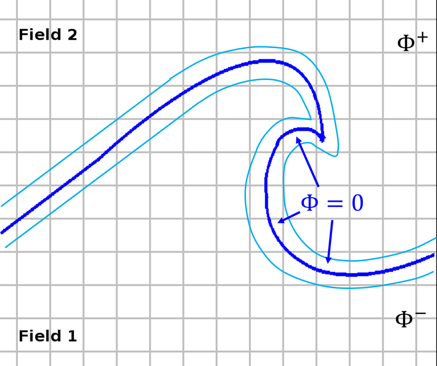
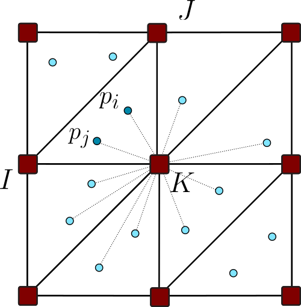
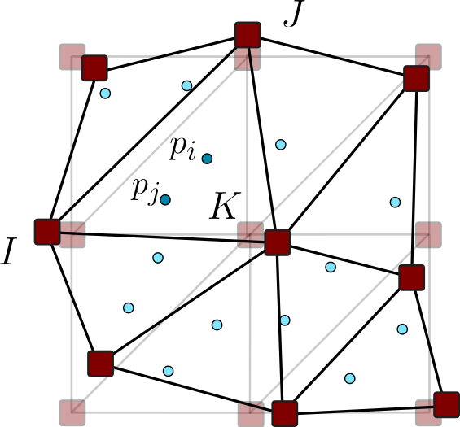
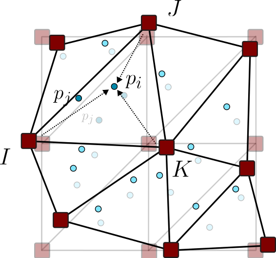
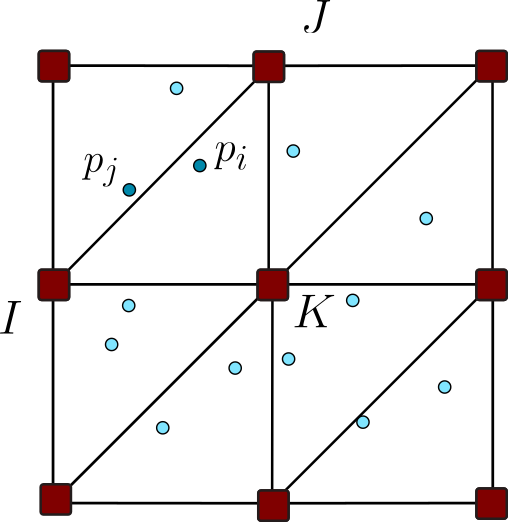
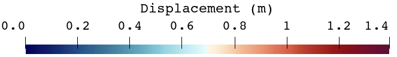
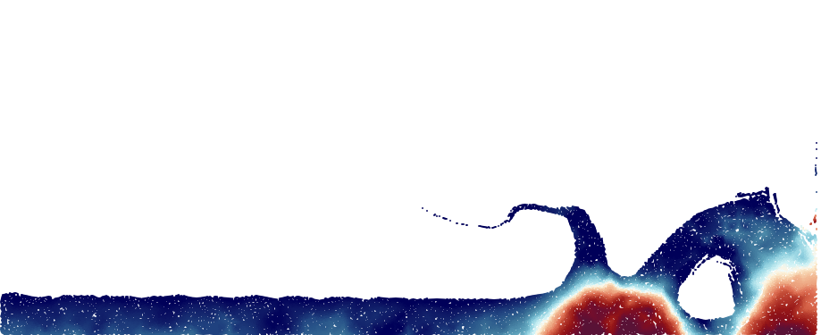
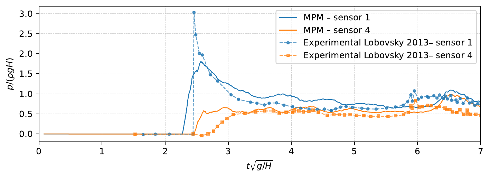

```{=html}
<div class="mpm-page">
  <main class="mpm-content">
    <a class="mpm-back" href="research.html">← Research areas</a>

    <nav class="mpm-top-nav" aria-label="On this page">
      <p>On this page</p>
      <a href="#overview"><span>01</span> Overview</a>
      <a href="#hyperelastic-formulation"><span>02</span> Hyperelastic formulation</a>
      <a href="#newtonian-formulation"><span>03</span> Newtonian formulation</a>
      <a href="#related-work"><span>04</span> Related work</a>
    </nav>

    <section class="mpm-hero">
      <div class="mpm-hero-copy">
        <p class="mpm-eyebrow">Current research</p>
        <p class="mpm-hero-lead">I develop stabilized Material Point Method formulations for incompressible materials undergoing large motion and deformation, with the long-term goal of reproducing the interacting phenomena involved in extreme hydrological events.</p>
        <div class="mpm-hero-tags"><span>Large deformations</span><span>Incompressibility</span><span>Free surfaces</span><span>Extreme events</span></div>
      </div>
      <figure class="mpm-hero-visual">
        
        <figcaption>Extreme hydrological events combine rapid flow, impacts, large deformation, and complex terrain. Photo: Moreno Geremetta.</figcaption>
      </figure>
    </section>

    <section class="mpm-section mpm-overview" id="overview">
      <div class="mpm-section-heading">
        <p class="mpm-section-number">01</p>
        <div><p class="mpm-eyebrow">Overview</p><h2>From extreme deformation to a hybrid numerical method</h2></div>
      </div>

      <div class="mpm-research-context">
        <p>Reproducing extreme hydrological events requires more than following a moving mass. A predictive model must combine <strong>large deformation</strong>, evolving <strong>free surfaces</strong>, <strong>incompressible materials</strong>, and the <strong>coupling</strong> between water, soil, debris, and structures. These phenomena interact across fluid and solid regimes and can involve impacts, fragmentation, and drastic changes in geometry.</p>
        <p>My research uses MPM to address the large-deformation and interface-tracking aspects of these problems, while developing stabilized mixed formulations for the incompressible regimes that arise in both solids and fluids. The longer-term objective is to bring these ingredients together in a unified framework for complex coupled simulations of extreme events.</p>
        <div class="mpm-context-tags"><span>Coupling</span><span>Large deformation</span><span>Free surfaces</span><span>Incompressibility</span></div>
      </div>

      <div class="mpm-overview-subsection" id="why-mpm">
        <p class="mpm-subsection-label">Why MPM?</p>
        <h3>The starting problem: a mesh that cannot follow indefinitely</h3>
        <p>In a conventional Lagrangian Finite Element Method, the mesh follows the material. This is highly effective while deformation remains moderate, but under extreme motion the elements may become severely distorted, degrading accuracy and eventually preventing the computation from continuing. Remeshing can alleviate the problem, but introduces additional cost and requires transferring the solution between meshes.</p>
      </div>

      <div class="mpm-fem-limitations">
        <figure>
          
          <figcaption><strong>Mesh distortion.</strong> In a Lagrangian FEM description, the elements deform with the material and can become extremely skewed.</figcaption>
        </figure>
        <figure>
          
          <figcaption><strong>Interface tracking.</strong> In Eulerian FEM simulations, an additional technique such as the level-set method is commonly required to locate and evolve a free surface.</figcaption>
        </figure>
      </div>

      <div class="mpm-method-intro">
        <h3>The MPM alternative</h3>
        <p>MPM retains a Lagrangian description through moving material points, but uses a background grid that does not follow the material permanently. Because the grid can be reset after every time step, the method accommodates very large deformation without accumulating mesh distortion. Free surfaces are also represented naturally by the evolving particle distribution, without a separate interface-tracking equation.</p>
      </div>

      <div class="mpm-callout mpm-discretizations-callout">
        <p class="mpm-callout-title">Two complementary discretizations</p>
        <p>The <strong>material points</strong> move with the material and store mass, motion, and constitutive history. The <strong>background grid</strong> provides the shape functions and computational structure used to solve the governing equations, and can be reset after each time step.</p>
      </div>

      <div class="mpm-cycle" aria-label="The Material Point Method cycle">
        <article><div><strong>1. Transfer</strong><span>Particle information is projected onto the background grid.</span></div></article>
        <article><div><strong>2. Solve</strong><span>The mechanical problem is solved at the grid nodes.</span></div></article>
        <article><div><strong>3. Update</strong><span>The solution updates the particles and their positions.</span></div></article>
        <article><div><strong>4. Reset</strong><span>The undeformed grid is recovered for the next time step.</span></div></article>
      </div>

      <figure class="mpm-wide-media mpm-valfredda">
        <video autoplay muted loop playsinline controls preload="metadata" aria-label="Two-dimensional MPM simulation of a granular flow over real terrain">
          <source src="valfredda2D.mp4" type="video/mp4">
        </video>
        <figcaption><strong>MPM in motion.</strong> A two-dimensional granular mass moves downhill over a real terrain profile. The red material points transport the material information while the stationary background grid provides the computational domain.</figcaption>
      </figure>

      <div class="mpm-frozen">
        <div class="mpm-frozen-copy">
          <p class="mpm-subsection-label">From avalanches to animation</p>
          <h3>MPM can reproduce the mixed solid–fluid behavior of snow</h3>
          <p>MPM is widely used for snow avalanches and granular flows because particles can carry complex material behavior through extreme deformation. The same capability also made it attractive in computer graphics: Walt Disney Animation Studios developed its Matterhorn snow simulator for <em>Frozen</em>, using MPM at its core to reproduce large quantities of snow interacting with characters.</p>
          <p><a href="https://www.disneyanimation.com/publications/a-material-point-method-for-snow-simulation/" target="_blank" rel="noopener">Read the Disney Animation technical publication →</a></p>
        </div>
        <div class="mpm-youtube">
          <iframe src="https://www.youtube-nocookie.com/embed/O0kyDKu8K-k" title="A Material Point Method for Snow Simulation" loading="lazy" allow="accelerometer; autoplay; clipboard-write; encrypted-media; gyroscope; picture-in-picture; web-share" allowfullscreen></iframe>
        </div>
      </div>
    </section>

    <section class="mpm-section mpm-work-section" id="hyperelastic-formulation">
      <div class="mpm-section-heading">
        <p class="mpm-section-number">02</p>
        <div><p class="mpm-eyebrow">Research work I · Incompressible solids</p><h2>Stabilized mixed MPM for hyperelastic materials</h2></div>
      </div>
      <div class="mpm-work-intro">
        <div>
          <p>Incompressible hyperelastic materials can undergo very large changes of shape while preserving their volume. Near this limit, standard displacement-based formulations may suffer from volumetric locking, an artificially stiff response, and oscillatory pressure fields.</p>
          <p>I developed a mixed displacement–pressure formulation in which pressure is treated as an independent unknown. Two stabilization strategies based on the Variational Multiscale framework—ASGS and OSGS—allow equal-order interpolation of displacement and pressure while retaining robustness in static and dynamic problems.</p>
        </div>
        <aside class="mpm-work-facts">
          <p class="mpm-focus-label">Technical focus</p>
          <span>Mixed u–p formulation</span><span>Incompressible hyperelasticity</span><span>ASGS &amp; OSGS</span><span>Implicit Newmark scheme</span><span>Kratos Multiphysics</span>
        </aside>
      </div>

      <article class="mpm-example mpm-example-standalone">
        <div class="mpm-example-media mpm-example-media-portrait">
          <video autoplay muted loop playsinline controls preload="metadata" aria-label="Twisting of an incompressible hyperelastic column">
            <source src="assets/research-mpm/twisting/twist.mp4" type="video/mp4">
          </video>
          
        </div>
        <div class="mpm-example-copy">
          <p class="mpm-focus-label">Selected result</p>
          <h3>Twisting an incompressible column</h3>
          <p>This demanding three-dimensional benchmark subjects a hyperelastic column to severe torsional deformation. It challenges the nonlinear solution, the incompressibility constraint, and the stability of the pressure field.</p>
          <p>The VMS-stabilized formulation remains robust where an alternative projection stabilization fails after only a few time steps. The analysis also distinguishes the influence of background-grid resolution from the cell-crossing effects associated with the particle discretization.</p>
          <p class="mpm-result"><strong>What it demonstrates:</strong> stable simulation of extreme deformation without remeshing, with accurate displacement evolution and a physically meaningful pressure field.</p>
        </div>
      </article>
    </section>

    <section class="mpm-section mpm-work-section" id="newtonian-formulation">
      <div class="mpm-section-heading">
        <p class="mpm-section-number">03</p>
        <div><p class="mpm-eyebrow">Research work II · Incompressible fluids</p><h2>An implicit MPM framework for Newtonian flows</h2></div>
      </div>
      <div class="mpm-work-intro">
        <div>
          <p>This ongoing work extends the same continuum-mechanics framework to incompressible Newtonian fluids. The fluid is represented through a rate-dependent constitutive law, providing a unified Lagrangian treatment that can be integrated within an existing solid-mechanics MPM solver.</p>
          <p>I developed and compared two alternatives: a computationally efficient irreducible formulation and a stabilized mixed displacement–pressure formulation. Both can capture the global motion of a free-surface flow, but the mixed formulation is essential when a stable and quantitatively reliable pressure field is required.</p>
        </div>
        <aside class="mpm-work-facts">
          <p class="mpm-focus-label">Technical focus</p>
          <span>Newtonian constitutive law</span><span>Irreducible vs. mixed</span><span>VMS stabilization</span><span>Free surfaces</span><span>Impact pressure</span>
        </aside>
      </div>

      <div class="mpm-dam-copy">
        <p class="mpm-focus-label">Selected result</p>
        <h3>Two-dimensional dam break</h3>
        <p>A collapsing water column produces rapid free-surface motion, wall impact, a strong pressure peak, and a reflected wave. The benchmark is validated against experimental measurements of front propagation, column height, and impact pressure. Both formulations reproduce the global fluid motion, but only the stabilized mixed formulation provides the smooth pressure response needed to quantify loads or couple the fluid with a structural solver.</p>
      </div>

      <figure class="mpm-wide-media mpm-dam-evolution">
        <video autoplay muted loop playsinline controls preload="metadata" aria-label="Displacement-magnitude field in a two-dimensional dam-break simulation using the stabilized mixed MPM formulation">
          <source src="assets/research-mpm/dam_break/dam_break.mp4" type="video/mp4">
        </video>
        <figcaption><strong>Dam-break evolution.</strong> The color map represents the displacement magnitude. The stabilized mixed formulation remains robust through collapse, wall impact, and reflection despite the rapidly changing free surface.</figcaption>
      </figure>

      <figure class="mpm-wide-media mpm-dam-pressure-field">
        
        <figcaption><strong>Pressure distribution during impact.</strong> The mixed formulation produces a smooth field and resolves the pressure concentration generated near the downstream wall.</figcaption>
      </figure>

      <figure class="mpm-wide-media mpm-pressure-figure">
        
        <figcaption><strong>Quantitative validation.</strong> Computed pressure histories at two wall sensors are compared with the experimental measurements of Lobovský et al. The mixed formulation captures the main impact and subsequent pressure evolution without the oscillations of the irreducible approach.</figcaption>
      </figure>

      <p class="mpm-result mpm-result-wide"><strong>What it demonstrates:</strong> accurate free-surface evolution together with non-oscillatory pressure predictions suitable for impact-load evaluation and future fluid–structure interaction applications.</p>
    </section>

    <section class="mpm-section" id="related-work">
      <div class="mpm-section-heading mpm-section-heading-compact">
        <p class="mpm-section-number">04</p>
        <div><p class="mpm-eyebrow">Related work</p><h2>Publications, software, and projects</h2></div>
      </div>
      <div class="mpm-related-grid">
        <article>
          <span class="mpm-work-status published">Published · 2025</span>
          <h3>A mixed stabilized MPM formulation for incompressible hyperelastic materials using Variational Subgrid-Scales</h3>
          <p>Laura Moreno, Antonia Larese, and Roland Wüchner · <em>Computer Methods in Applied Mechanics and Engineering</em>, 435, 117621.</p>
          <p><a href="https://doi.org/10.1016/j.cma.2024.117621">DOI</a> · <a href="assets/docs/artweb008-lm.pdf">Post-print</a></p>
        </article>
        <article>
          <span class="mpm-work-status submitted">Submitted · August 2026</span>
          <h3>An implicit MPM framework for incompressible Newtonian fluids: Irreducible and stabilized mixed formulations</h3>
          <p>Laura Moreno, Gioele De Zotti, and Antonia Larese.</p>
          <p class="mpm-muted">Submitted to <em>Computer Methods in Applied Mechanics and Engineering</em>.</p>
          <p><a href="assets/docs/artweb010-lm.pdf">Preprint</a></p>
        </article>
        <article>
          <span class="mpm-work-status published">Published · 2026</span>
          <h3>Rainfall-triggered debris flows: The July 10, 2018, event at Cerro del Quinceo and its simulation using the material point method</h3>
          <p>Miguel Ángel Rodríguez Velázquez, Laura Moreno Martínez, Carlos Chávez Negrete, Constantino Domínguez Sánchez, and Francisco Javier Domínguez Mota · <em>Ingeniería Investigación y Tecnología</em>, 27(3), 1–9.</p>
          <p><a href="https://www.revistaingenieria.unam.mx/numeros/v27n3-04.php" target="_blank" rel="noopener">Article</a></p>
        </article>
        <article class="mpm-related-small">
          <p class="mpm-focus-label">Open-source software</p>
          <h3>Kratos Multiphysics</h3>
          <p>The formulations and numerical examples are implemented within the open-source Kratos Multiphysics framework.</p>
          <a href="https://github.com/KratosMultiphysics/Kratos" target="_blank" rel="noopener">View repository →</a>
        </article>
        <article class="mpm-related-small">
          <p class="mpm-focus-label">Research context</p>
          <h3>GRK 2075 &amp; NEMESIS</h3>
          <p>This research developed across postdoctoral work at TU Braunschweig and the University of Padua.</p>
          <a href="projects.html">View related projects →</a>
        </article>
      </div>
    </section>

    <p class="mpm-contribution"><strong>My contribution.</strong> I have led the formulation development, software implementation, simulation design, validation, analysis, and scientific writing of this research line, in collaboration with Antonia Larese, Roland Wüchner, and Gioele De Zotti.</p>
    <p class="mpm-footnote">This research line is ongoing. Additional results on incompressible Newtonian flows and coupled problems will be incorporated as they become available.</p>
  </main>
</div>
```
